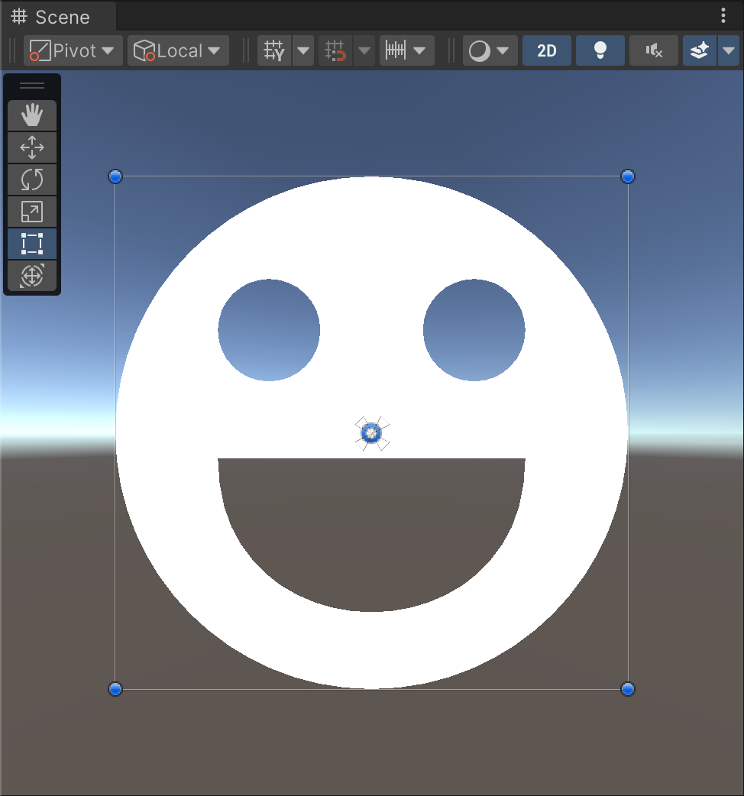

# Lyon Tesselation
(WIP) Tessellation of vector paths in Unity, powered by [lyon](https://github.com/nical/lyon).



## Features
- Supports both Fill and Stroke tessellation, with several configurations provided by lyon
- Easy to use [PathBuilder](Runtime/PathBuilder.cs) API for drawing paths that will be passed to the [Tessellator](Runtime/Tessellator.cs)
- Run multithreaded tessellation with the [Job System](https://docs.unity3d.com/Manual/JobSystemOverview.html) and [Burst](https://docs.unity3d.com/Packages/com.unity.burst@1.8/manual/index.html) by leveraging the `Create*Job` methods from `Tessellator`
- Both `PathBuilder` and `Tessellator` support reusing memory, just call `Clear()` instead of disposing of them and allocating new instances
- Prebuilt for the following platforms: Windows (x86_64), Linux (x86_64), macOS (x86_64, arm64), iOS (arm64), Android (arm32, arm64, x86, x86_64)


## Usage example
```cs
using Gilzoide.LyonTesselation;
using UnityEngine;
using UnityEngine.Jobs;
using UnityEngine.UI;

// 1. Create a path
var path = new PathBuilder();
path.AddCircle(Vector2.zero, 100)
    .AddCircle(new Vector2(20, 20), 20)
    .AddCircle(new Vector2(20, 20), 20)
    .BeginAt(new Vector2(30, 5))
        .CubicBezierTo(
            new Vector2(30, 45),
            new Vector2(30, 45),
            new Vector2(30, 5)
        )
    .Close();

// 2. Create a Tessellator
// The type parameters represent the Vertex and Index types:
// - Vertex type must contain at least 2 floats, for the position
// - Index type should be an integer of at least 16 bits (ushort, int...)
// In this example, we'll use UIVertex for building meshes for Unity UI.
var tessellator = Tessellator<UIVertex, int>.Allocate();

// 3. Tessellate! This will fill the tessellator's internal buffers
// 3.a) AppendPathFill will triangulate the path's fill
tessellator.AppendPathFill(path);
// Alternatively, schedule the path fill using Unity's Job System
JobHandle fillJob = tessellator.CreatePathFillJob(path).Schedule();
// 3.b) AppendPathFill will triangulate the path's stroke
tessellator.AppendPathStroke();
// Alternatively, schedule the path stroke using Unity's Job System
JobHandle strokeJob = tessellator.CreatePathStrokeJob(path).Schedule();

// 4. Fetch the vertex buffer and index buffer for whatever
// If you used jobs for fill/stroke, make sure to complete them first.
fillJob.Complete();
strokeJob.Complete();
NativeArray<UIVertex> vertices = tessellator.Vertices;
NativeArray<int> indices = tessellator.Indices;
DoSomethingLikeFillAVertexHelper(vertices, indices);

// 5. Dispose of paths and tessellators when not needed anymore.
tessellator.Dispose();
path.Dispose();
```